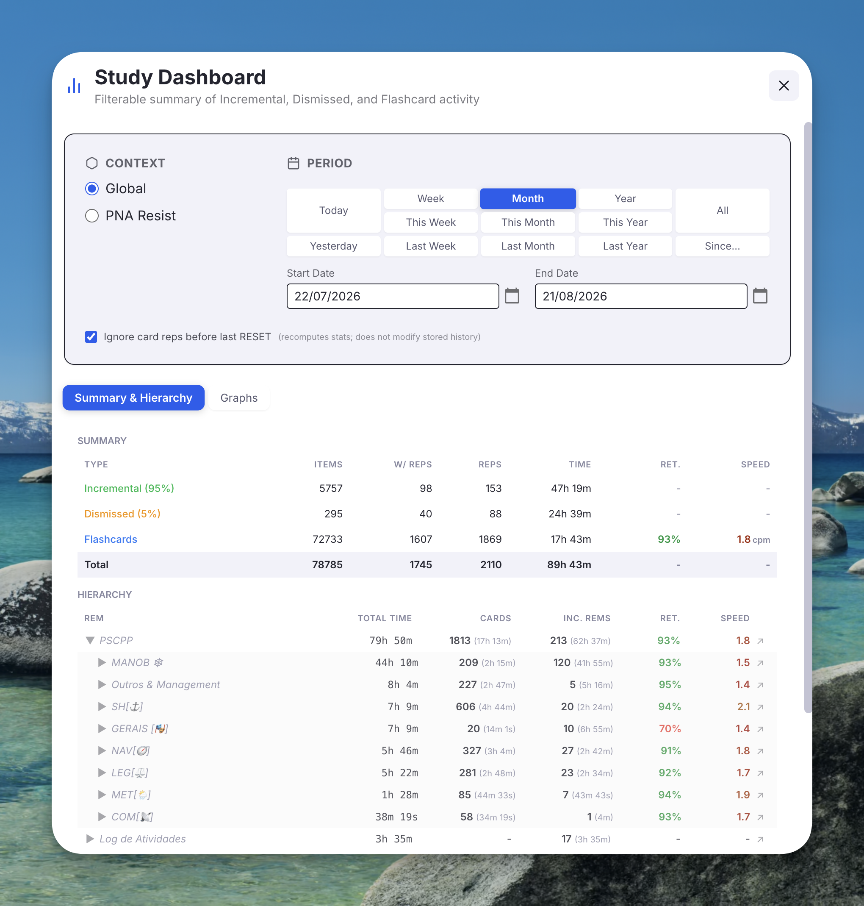
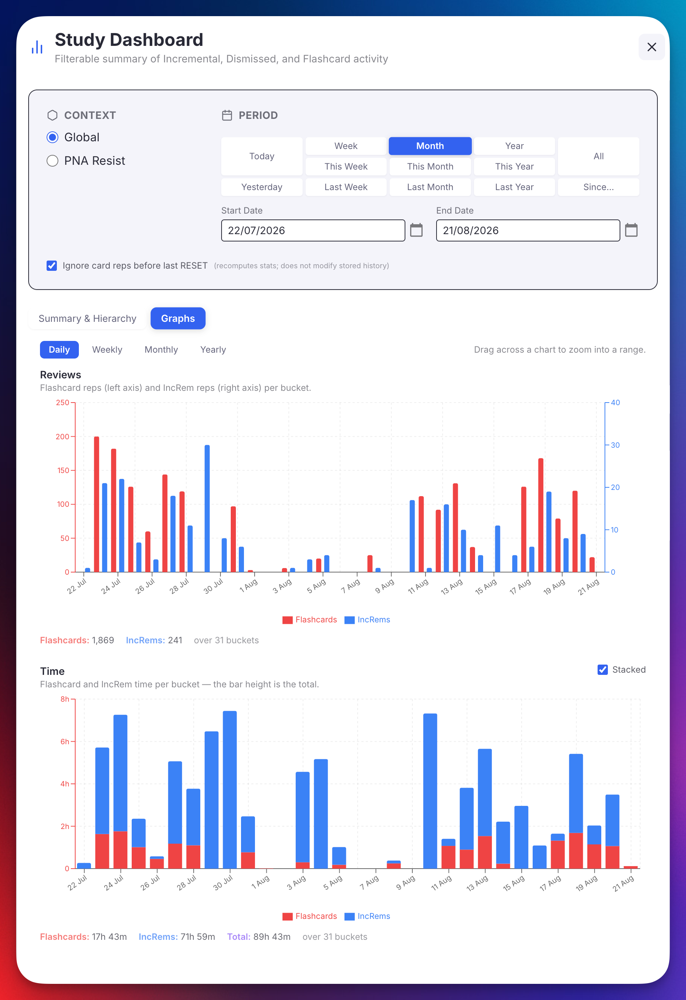
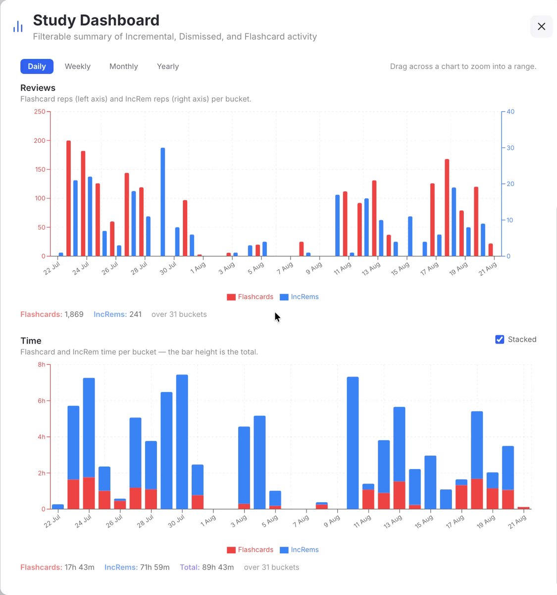

# Study Dashboard

The **Study Dashboard** is a filterable popup that summarizes your *Incremental*, *Dismissed*, and *Flashcard* activity across the whole knowledge base or scoped to a single document, with a fully expandable **hierarchy view** showing time, reps, retention, and speed at every level of your rem tree.

It was inspired by the [Statistics Plugin](https://github.com/Justtolook/RemNote-Statistics-Plugin) (period filters and context selector) and combines those controls with data from the existing [Aggregated Repetition History](Plugin-Widgets-Reference.md#212-increm-repetition-history-aggregated-view) and [Practiced Queues History](History-Queue-Dashboard-and-Mastery-Drill.md#practiced-queues-history-live-dashboard) widgets.

---

---

## What it shows

Below the **Context / Period** box the popup has two tabs. The filters live *above* the tabs, so whatever context and period you pick applies to both.

**Summary & Hierarchy** — two stacked sections:

1. **Summary** — three rows (*Incremental*, *Dismissed*, *Flashcards*) plus a bold **Total** row, with columns for `Items`, `Items w/ Reps`, `Reps`, `Time`, and (for Flashcards) average retention and speed.
2. **Hierarchy** — every top-level rem with activity in the selected period, expandable into the full ancestor tree. Each row shows total time, card reps + time, IncRem reps + time (sum of Incremental + Dismissed history), retention %, and speed in cards-per-minute.

**[Graphs](#graphs-tab)** — the same period plotted over time: reviews per bucket, and time per bucket.

{ width="900" }

---

## Opening it

- **Command Palette:** *Open Study Dashboard* (quick code `sdb`)
- The dashboard always opens in **Global** mode by default.
- If a rem is focused in the editor (or you're reviewing a card in the queue), the command passes it along as the Document-mode root — you can switch to **Document** inside the popup at any time. Without a rem context, the *Document* radio is greyed out and Global is the only option.

---

## Filters

### Context

- **Global** — every IncRem, Dismissed rem, and Card-bearing rem across the entire KB.
- **Document** — only rems in scope of the rem you opened the dashboard from. Two scope sub-modes:
  - **Descendants Only** — `rootRem` and every descendant via `getDescendants()`.
  - **Comprehensive** — uses the same scope expansion as the rest of the plugin: descendants, rems in the same document/portal, folder-queue contents, source documents (recursively), referencing rems, PDF extracts and PDF descendants. See [Prioritization & Sorting → Comprehensive scope](Prioritization-&-Sorting.md) for the full definition.

The Document option is greyed out if the dashboard was opened without any rem context.

### Period

Twelve presets in a tidy 5×3 grid, plus an **All** button and explicit **Start / End** date inputs:

| Today | Week | Month | Year | All |
| - | - | - | - | - |
| Yesterday | This Week | This Month | This Year | |
| | Last Week | Last Month | Last Year | |

- Clicking a preset auto-fills both date inputs to the resolved range.
- Editing either date directly switches the picker to **custom**.
- **All** clears the inputs (no meaningful start date).
- Default on first open is **This Year**.
- Every boundary is **your local midnight**, so a range of `27/07` → `27/07` covers exactly the day you lived through, matching what RemNote's own Flashcards → Stats heatmap reports for that date.

---

## Summary section

| Column | Meaning |
|---|---|
| **Items** | Total rems tagged (or, for Flashcards, total cards) in the selected scope — period-independent. |
| **w/ Reps** | Subset of the above that had at least one repetition inside the period. |
| **Reps** | Total qualifying repetitions in the period. |
| **Time** | Total review time in the period. |
| **Ret.** | (Flashcards only) `(reps − again-count) / reps`, color-coded ≥90 % green / <80 % red / yellow. |
| **Speed** | (Flashcards only) Cards per minute, color-coded with a 1.5 → 4 cpm gradient. |

The percentages next to **Incremental** and **Dismissed** show each one's share of `Incremental + Dismissed` items.

The bold **Total** row sums Items / w-Reps / Reps / Time across the three types. Retention and Speed are not aggregated across types (they aren't meaningfully addable).

Filtering rules match the plugin's other authoritative-summary tooling:
- Cards count only when scored `AGAIN`, `HARD`, `GOOD`, or `EASY` (RemNote's `TOO_EARLY`, `VIEWED_AS_LEECH`, `RESET`, `MANUAL_DATE`, `MANUAL_EASE` are excluded).
- IncRem reps count only for `rep`, `executeRepetition`, and `rescheduledInQueue` event types (rescheduledInEditor, manualDateReset, lifecycle markers are excluded).
- Card response time is capped by the **Flashcard response time limit** setting (default 180 s). IncRem `reviewTimeSeconds` is intentionally **uncapped** — an IncRem rep can legitimately span minutes of reading.

---

## Hierarchy section

The hierarchy lists every rem with activity *inside the selected period*, organized as a collapsible tree:

- **Top-level rows** = rems whose parent is null or outside the scope. Sorted by total time descending.
- Click ▶ to expand a branch and reveal the full subtree under it. Children are sorted by total time descending too.
- Rems that are themselves *Incremental* or *Dismissed* get a colored dot (●) next to their name.
- Rems whose history carries [review notes](Reviewing-Items-in-the-Queue.md#the-answer-buttons) show a **📝 icon** after the name — hover to read them (dated, newest first, capped at 8 with an overflow hint; open the Repetition History popup for the full list). All of the rem's notes are shown regardless of the selected period, so annotations never silently vanish when you narrow the filter.
- The ↗ icon on each row opens the rem in the editor (PDF-aware: PDF highlights/extracts open as a page).
- Branches with zero reps in the period are **pruned at every level**. If you change to *All*, more rems re-appear.
- **Structural ancestor nodes** — rems that have no own data but are needed to keep the tree connected — render in italics with reduced opacity. Their numbers are the bottom-up aggregate of their descendants.

Each row's columns:

| Column | Meaning |
|---|---|
| **Total Time** | Card time + IncRem time, summed across the subtree (in the period). |
| **Cards** | Card reps in the period, with the time spent in parentheses. |
| **Inc. Rems** | IncRem reps **including history of dismissed rems** in the period, with time in parentheses. |
| **Ret.** | Retention across all cards in the subtree (in the period). |
| **Speed** | Cards-per-minute across the subtree. |

### Global mode — top-level rems

In Global mode, a "top-level rem" is the highest ancestor (where `parent === null`) that has, anywhere in its subtree, at least one IncRem rep or card rep inside the selected period. Each top-level row's numbers are the bottom-up aggregate of everything beneath it.

### Document mode — root

In Document mode the root row is the rem the dashboard was opened from (or its closest in-scope ancestor when in Comprehensive mode, see below).

---

## Graphs tab

An alternative reading of the same numbers the Summary counts, spread over the timeline instead of collapsed into a single row — a drawn counterpart to the [Practiced Queues History](History-Queue-Dashboard-and-Mastery-Drill.md#practiced-queues-history-live-dashboard) summary table (with [one difference](#what-it-counts)).

{ width="800" }

### The two charts

| Chart | Left axis | Right axis |
|---|---|---|
| **Reviews** | Flashcard reps | IncRem reps (Incremental + Dismissed) |
| **Time** | Flashcard time and IncRem time — one shared scale | — |

Reviews get **two scales** because in a typical knowledge base flashcard reps outnumber IncRem reps by an order of magnitude; on a single axis the IncRem bars would be flattened to nothing. Times are comparable, so that chart keeps one scale — which also lets it stack.

### Granularity

**Daily / Weekly / Monthly / Yearly** buckets the selected period along the x-axis. Weeks start on Sunday, matching the rest of the plugin's period maths.

Switching is instant: it re-groups data already in memory, it does not re-read the knowledge base. The totals under each chart don't move when you switch, because coarser buckets only regroup the same reps.

{ width="750" }

Days with no activity are drawn as zero bars, so the axis reads as a real timeline rather than a list of the days you happened to study. The span runs from your first to your last activity inside the period, so a half-finished year doesn't squeeze the bars that carry data into a corner.

If a period would produce more than 800 bars (say *All* at daily granularity), the chart steps down to the next coarser bucket and tells you it did.

### Stacked vs. side by side

The Time chart carries a **Stacked** checkbox, on by default:

- **Stacked** — Flashcards and IncRems stack into one bar, so the **bar height is the bucket's total time**. No separate "total" mark is drawn, because it would be the same height twice.
- **Unchecked** — the two sit side by side on a shared baseline, which makes their evolution easier to compare, at the cost of the per-bucket total.

Either way the **tooltip** and the totals line below the chart report Flashcards, IncRems *and* Total. The y-axis ceiling follows the mode — the sum of the two series when stacked, the taller of the two when they're side by side.

The Reviews chart is always side by side: its two series live on different axes, so stacking them would mean nothing.

### Zooming

**Drag horizontally across either chart** to zoom into that range. Both charts follow — they are two readings of one timeline — and a **Reset Data Range** button appears to return to the full period. This is the same interaction as the [Priority Shield History](Prioritization-&-Sorting.md#priority-shield-history) graphs.

{ width="700" }

Both y-axes always fit themselves to the values *currently on screen*, zoomed or not, so the plot area is never wasted on empty headroom. That's the behaviour the Priority Shield graphs put behind an **Optimize Priorities Zoom** button, applied automatically here.

The totals line under each chart reports what the **visible** range adds up to — so after zooming it describes the zoom, not the period.

### What it counts

Exactly what the [Summary section](#summary-section) counts: the same qualifying rep types, the same handling of dismissed history (folded into IncRems), and the same **Flashcard response time limit** cap on card times. Unzoomed, the bars of either chart sum to the matching Summary cell.

That also means the graphs read **rem repetition histories**, the way the rest of this dashboard does — not the session records behind the Practiced Queues table. The two answer slightly different questions ("what has been reviewed", vs. "what happened in a queue session"), so small differences between them are expected. The advantage of reading histories is that the graphs honour the **Context** selector: switch to Document mode and they redraw for that document alone.

Your tab, granularity and Stacked choice are remembered on this device, alongside the period.

---

## Global vs. Document

| | Global | Document — Descendants | Document — Comprehensive |
|---|---|---|---|
| Scope | Every IncRem, Dismissed, and card-bearing rem in the KB | `rootRem.getDescendants()` (inclusive of rootRem) | Same as the rest of the plugin's comprehensive scope: descendants + portals + folder queue + referencing rems + sources (recursive) + PDF extracts/descendants |
| Roots in the hierarchy | All top-level KB rems with activity | The selected rem | Same — plus structural rems above when comprehensive expansion reached outside the rem's own subtree |

---

## Comprehensive scope + hierarchy

The Comprehensive scope, by construction, can include rems whose parents are *not* themselves in the scope (e.g. a PDF extract belonging to a source document referenced from inside the document being analyzed). To keep the rendered tree connected and intelligible, the dashboard walks every in-scope rem's parent chain and materializes any missing ancestors as **structural-only nodes** — italic rows with no self-data, whose role is purely to give the tree a coherent shape from each leaf up to a real root.

The aggregate numbers on a structural node are the sum of its descendants — so even though the node has no reps of its own, it gives you a meaningful per-branch breakdown.

---

## Performance notes

The dashboard's data load can be heavy on large knowledge bases. Several optimizations keep it manageable:

1. **Bulk fetching**: at load time the dashboard issues a small fixed set of bulk calls — `taggedRem()` for the *Incremental*, *Dismissed*, and *cardPriority* powerups, plus a single `card.getAll()` — instead of per-rem RPCs. Because the *cardPriority* powerup typically covers every card-bearing rem in a KB, those bulk calls provide free `parent` and `text` info for the vast majority of rems-with-data, so chain-walking needs almost zero additional `findOne` calls.
2. **Period changes are instant**: the heavy data load happens **once per session/scope**. Switching the period reuses the cached data and performs only an in-memory aggregation pass.
3. **Pre-built subtrees**: in Global mode the per-top-level subtrees are assembled at load time from the cached parent chains. Expanding any top-level row is therefore instant, with no further RPCs.
4. **Parallel ancestor walks**: ancestor chains are resolved in chunks of 50 with an in-flight promise cache, so sibling rems that share an ancestor path do that work only once.
5. **Progress bar**: the popup shows a progress bar during loading (0–80 % for fetch, 80–100 % for aggregation) with a label so you can see what phase it's in.

When you change the *context* (Global ↔ Document) or *scope* (Descendants ↔ Comprehensive), the dashboard reloads the relevant data set. When you only change the *period*, it doesn't.

---

## Command

| Command | Quick Code | Description |
|---|---|---|
| **Open Study Dashboard** | `sdb` | Opens the dashboard popup. Auto-detects the focused rem in the editor or the current card in the queue and uses it as the Document-mode root. If no rem context is available it opens in Global mode. |

📖 See [Plugin Commands Reference](Plugin-Commands-Reference.md) for the full command list.
